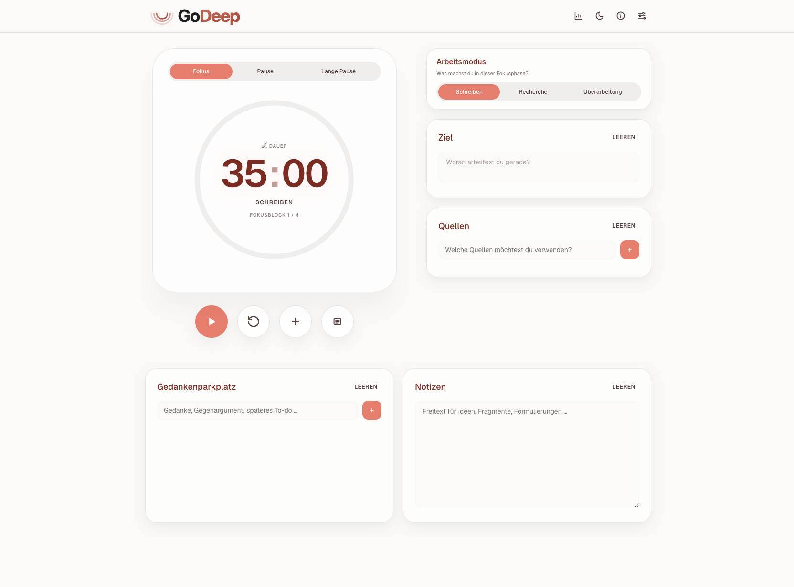

<p align="center">
  
</p>

# GoDeep

GoDeep ist eine minimalistische Fokus-App für Deep-Work-Sessions, insbesondere beim wissenschaftlichen Arbeiten.

## App-Screenshot

<p align="center">
  
</p>

## Features

- Pomodoro-Timer mit Fokus-/Pause-/Lange-Pause-Phasen
- Arbeitsmodi mit eigenen Standarddauern (Schreiben, Recherche, Überarbeitung)
- Session-Wizard mit Ziel, Quellen, Modus und Dauer
- Session-Review mit Hinweis auf den letzten Anknuepfungspunkt
- Session-Historie mit Detailansicht, Export und Loeschen pro Session
- Statistik-Modal (Heute + Wochenansicht)
- Light-/Dark-Mode Toggle
- Timer-Sound-Auswahl (Standard / Easy)
- Lokale Persistenz via `localStorage` (keine Server-Abhaengigkeit)

## Projektstruktur

```text
GoDeep/
  index.html
  css/
    variables.css
    style.css
    godeep_logo.png
    godeep_logo.svg
    godeep_logo_dark.svg
    favicon.svg
  js/
    app.js
    storage.js
    timer.js
    workspace.js
    session-wizard.js
    history.js
    settings.js
    theme.js
    ...
  assets/
    timer-standard.mp3
    timer-easy.mp3
```

## Lokal nutzen (Entwicklung/Test)

### 1) Direkt im Browser (am schnellsten)

1. Repository klonen oder Ordner lokal bereitstellen.
2. `index.html` in einem modernen Browser öffnen.

### 2) Lokal mit Webserver (empfohlen)

1. Projekt in dein lokales Webroot legen (z. B. XAMPP `htdocs`).
2. Im Browser aufrufen, z. B. `http://localhost/GoDeep/`.

## Server-Deployment (Produktiv oder extern erreichbar)

GoDeep ist eine statische Web-App (HTML, CSS, JS) ohne Build-Prozess.

### 1) Klassisches Hosting (Shared Hosting / Apache / Nginx)

1. Projektdateien per FTP/SFTP ins Zielverzeichnis hochladen (z. B. `public_html`, `www` oder vHost-Document-Root).
2. Sicherstellen, dass `index.html`, `css/`, `js/` und `assets/` zusammen im selben Webroot liegen.
3. Deployment-URL im Browser aufrufen.

### 2) Docker-Deployment (einfach mit Apache)

Mit Docker Compose wird ein Apache-Container gestartet, der den Projektordner als Volume einbindet.

1. Docker Desktop oder Docker Engine + Compose Plugin installieren.
2. Im Projektordner starten: `docker compose up -d`
3. Im Browser öffnen: `http://localhost:9095`
4. Container stoppen: `docker compose down`

Der Container liefert den gemounteten Projektordner direkt aus (`./` -> `/usr/local/apache2/htdocs/`).

Hinweis zur Persistenz: Die App speichert Daten pro Browser in `localStorage` (clientseitig), nicht serverseitig.

Sicherheits-Hinweis: Für den externen Betrieb sollte idealerweise ein Reverse Proxy oder ein Cloudflare Tunnel vorgeschaltet werden, damit die App sicher per HTTPS erreichbar ist und über den Standardport `443` bereitgestellt wird.

## Updates einspielen

### 1) Lokal (direkt im Browser)

1. Neue Version holen (z. B. per `git pull` oder Dateien überschreiben).
2. Browser-Tab neu laden (ggf. Hard-Reload mit `Cmd+Shift+R`).

### 2) Klassisches Hosting / Webserver

1. Geänderte Dateien auf den Server hochladen (`index.html`, `css/`, `js/`, `assets/`).
2. Seite neu laden; bei Cache-Problemen Browser-Cache leeren oder Hard-Reload ausführen.

### 3) Docker-Deployment

Bei diesem Setup wird der Projektordner als Volume gemountet. Das bedeutet:

- **Code-Updates (GoDeep-Dateien):** Dateien im Projektordner aktualisieren, danach reicht meist ein Reload im Browser.
- **Container-/Image-Updates (Apache):** Neues Image ziehen und Container neu erstellen:
  - `docker compose pull`
  - `docker compose up -d --force-recreate`

Optional bei Problemen: `docker compose down` und danach `docker compose up -d`.

### Update Quick Commands

```bash
# Lokal (Git)
git pull
```

```bash
# Docker (Code-Updates im gemounteten Projektordner)
docker compose down
git pull
docker compose up -d
```

```bash
# Docker (Apache-Image aktualisieren)
docker compose pull
docker compose up -d --force-recreate
```

## Nutzung (Kurz)

1. Modus und Fokusdauer wählen (oder **Neue Session** starten).
2. Timer starten.
3. Nach Ablauf optional Review erfassen.
4. Historie fuer vergangene Sessions, Export und Loeschen nutzen.

## Daten & Persistenz

- Alle Daten werden im Browser in `localStorage` gespeichert.
- Einstellungen, Workspace-Inhalte, Timer-Zustand und Historie bleiben zwischen Browser-Neustarts erhalten.
- Beim Loeschen von Website-Daten im Browser werden gespeicherte Inhalte entfernt.

## Lizenz

Dieses Projekt steht unter der MIT-Lizenz.  
Siehe Datei [`LICENSE`](./LICENSE).

