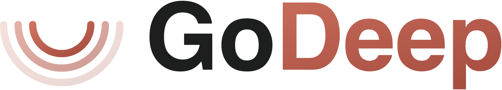
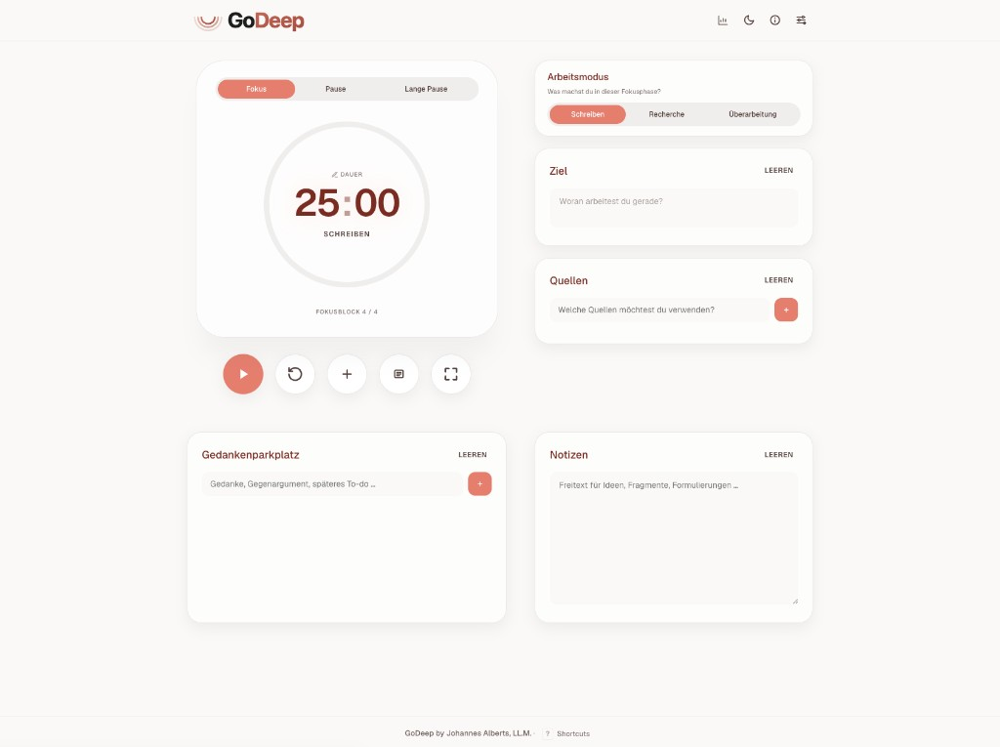
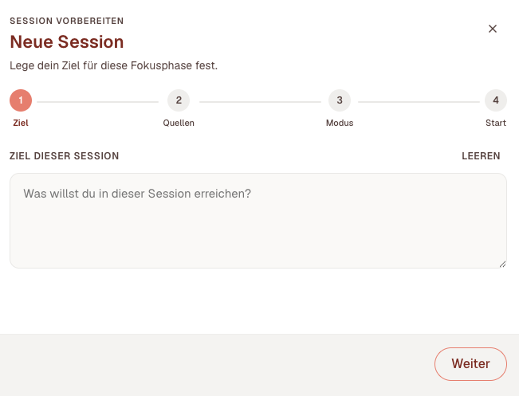

<p align="center">
  
</p>

# GoDeep

**Fokus-App für Deep-Work-Sessions – besonders beim wissenschaftlichen Arbeiten.**

GoDeep verbindet einen Pomodoro-Timer mit einem strukturierten Arbeitsbereich: Ziel, Quellen, Gedankenparkplatz, Notizen, Session-Wizard, Review und Historie. Alles läuft lokal im Browser – ohne Account, ohne Server, ohne Build-Schritt.

<p align="center">
  
  
  
  
</p>

## Inhalt

- [Screenshots](#screenshots)
- [Was GoDeep anders macht](#was-godeep-anders-macht)
- [Features](#features)
- [Schnellstart](#schnellstart)
- [Nutzung](#nutzung)
- [Tastenkürzel](#tastenkürzel)
- [Deployment](#deployment)
- [Technik & Datenschutz](#technik--datenschutz)
- [Updates](#updates)
- [Autor & Lizenz](#autor--lizenz)

## Screenshots

### Dashboard

*Timer, Arbeitsmodus, Ziel, Quellen, Gedankenparkplatz und Notizen in einer Session.*

<p align="center">
  
</p>

### Session-Wizard

*Neue Session in vier Schritten: Ziel, Quellen, Modus, Start.*

<p align="center">
  
</p>

## Was GoDeep anders macht

| Typischer Pomodoro-Timer | GoDeep |
|---|---|
| Nur Countdown | Timer + Ziel, Quellen, Gedanken, Notizen |
| Keine Session-Struktur | Wizard, Review und Session-Historie |
| Keine Unterbrechungsanalyse | Pausen werden gezählt und protokolliert |
| Cloud / Account oft nötig | Lokal im Browser, `localStorage` only |

## Features

**Fokusarbeit**

- Pomodoro-Timer mit Fokus-, Pause- und Langer-Pause-Phasen
- Arbeitsmodi mit eigenen Standarddauern (Schreiben, Recherche, Überarbeitung)
- Fokusmodus: nur Timer sichtbar (`F` oder Button)
- Unterbrechungs-Protokollierung per Pause (Anzahl und Dauer)
- Timer-Sound (Standard / Easy), Desktop-Benachrichtigungen
- Light-/Dark-Mode

**Organisation & Reflexion**

- Session-Wizard mit Ziel, Quellen, Modus und Dauer
- Session-Review mit Hinweis auf den letzten Anknüpfungspunkt
- Mehrere Notizen pro Session (Card-Übersicht + Detailansicht)
- Session-Historie mit Detailansicht, Export (ZIP) und Löschen
- Statistik-Modal (Heute + Wochenansicht)
- Tastenkürzel für häufige Aktionen

## Schnellstart

```bash
git clone https://github.com/johannesalberts/godeep.git
cd godeep
```

**Variante A – direkt im Browser**

`index.html` in Chrome, Firefox, Safari oder Edge öffnen.

**Variante B – mit Docker**

```bash
docker compose up -d
# → http://localhost:9095
```

**Variante C – lokaler Webserver**

Projekt in ein Webroot legen (z. B. XAMPP `htdocs`) und aufrufen, z. B. `http://localhost/GoDeep/`.

## Nutzung

1. Modus und Fokusdauer wählen – oder **Neue Session** über den Wizard starten.
2. Timer starten und im Arbeitsbereich Ziel, Quellen und Notizen pflegen.
3. Nach Ablauf optional ein Review erfassen.
4. Historie, Export und Statistik für vergangene Sessions nutzen.

**Unterbrechungen:** Im Fokus-Modus zählt jede Pause als Unterbrechung. Beim Fortsetzen wird die Dauer erfasst; nach dem Block findest du Anzahl, Gesamtzeit und Einzelzeiten in der Session-Historie.

**Notizen:** Ab der zweiten Notiz wechselt GoDeep in eine Card-Übersicht mit Detailansicht pro Notiz.

**Fokusmodus:** Über den Button neben den Timer-Steuerungen oder mit `F` blendest du Workspace und Gedankenparkplatz aus – nur der Timer bleibt sichtbar.

## Tastenkürzel

| Taste | Aktion |
|---|---|
| `Leertaste` | Timer starten / pausieren |
| `N` | Neue Session |
| `F` | Fokusmodus ein / aus |
| `Esc` | Dialog schließen |
| `?` | Shortcuts anzeigen |

Die Shortcuts findest du im **Seitenfooter** als Popover (**„? Shortcuts“**). In Eingabefeldern sind die Kürzel deaktiviert, damit du normal tippen kannst.

## Deployment

GoDeep ist eine statische Single-Page-App (`index.html` + `css/` + `js/` + `assets/`) ohne Build-Prozess.

### Klassisches Hosting (Apache / Nginx / Shared Hosting)

1. Projektdateien per FTP/SFTP ins Zielverzeichnis hochladen (`public_html`, `www` oder Document-Root).
2. Sicherstellen, dass `index.html`, `css/`, `js/` und `assets/` im selben Webroot liegen.
3. Deployment-URL im Browser aufrufen.

### Docker

```bash
docker compose up -d      # starten → http://localhost:9095
docker compose down       # stoppen
```

Der Container mountet den Projektordner read-only nach `/usr/local/apache2/htdocs/`.

**HTTPS:** Für externen Betrieb einen Reverse Proxy oder Cloudflare Tunnel vorschalten, damit die App sicher über Port `443` erreichbar ist.

## Technik & Datenschutz

- **Architektur:** Statische Web-App – Timer (`timer.js`), Workspace & Wizard, Persistenz (`storage.js`), Export (`export.js`).
- **Daten:** Alles wird clientseitig in `localStorage` gespeichert. Keine Accounts, kein Tracking, keine Server-Kommunikation.
- **Persistenz:** Einstellungen, Workspace, Timer-Zustand und Historie bleiben zwischen Browser-Neustarts erhalten. Beim Löschen von Website-Daten im Browser gehen gespeicherte Inhalte verloren.
- **Browser:** Moderne Browser (Chrome, Firefox, Safari, Edge).

```
GoDeep/
  index.html          # Einstieg
  docker-compose.yml
  css/                # Styles, Logos, Favicon
  js/                 # App-Logik (Timer, Workspace, Wizard, Historie, …)
  assets/             # Screenshots, Timer-Sounds
```

## Updates

```bash
git pull
# Browser-Tab neu laden (ggf. Cmd+Shift+R)
```

**Docker (Code im gemounteten Ordner):** Dateien aktualisieren, Container läuft weiter – Reload im Browser reicht.

**Docker (Apache-Image):**

```bash
docker compose pull
docker compose up -d --force-recreate
```

Bei klassischem Hosting geänderte Dateien (`index.html`, `css/`, `js/`, `assets/`) hochladen und neu laden.

## Autor & Lizenz

**Johannes Alberts, LL.M.**

- [www.johannesalberts.de](https://www.johannesalberts.de)
- [mail@johannesalberts.de](mailto:mail@johannesalberts.de)
- [LinkedIn](https://www.linkedin.com/in/johannes-alberts-ll-m-aab543174)

Dieses Projekt steht unter der [MIT-Lizenz](./LICENSE).
